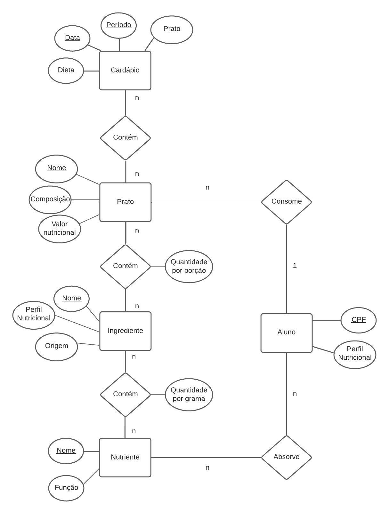

# Equipe `<SHREK>`

# Subgrupo `<CHAVE>`
* `<Gabriel Freitas Pinheiro>` - `<222339>`
* `<Matheus de Mello Barreto Mendes André>` - `<243413>`
* `<Henrique de Lima>` - `<223911>`

## Modelo Conceitual ER Revisado

*Diagrama ER revisado;*

## Mapeamento para o Modelo Relacional

~~~
NUTRIENTES(_Nome_, Funcao)
INGREDIENTE(_Nome_, PerfilNutricional, Origem)
  PerfilNutricional chave estrangeira -> NUTRIENTE(Nome)
PRATO(_Nome_, Composicao, ValorNutriocional)
  ValorNutriocional chave estrangeira -> NUTRIENTE(Nome)
  Composicao chave estrangeira -> Ingrediente(Nome)
CARDÁPIO(_Período_, _Data_, Dieta, Prato)
  Prato chave estrangeira -> PRATO(Nome)
ALUNO(_Nome_, Consome, Absorve)
  Consome chave estrangeira -> PRATO(Nome)
  Absorve chave estrangeira -> INGREDIENTE(Nome)
~~~
